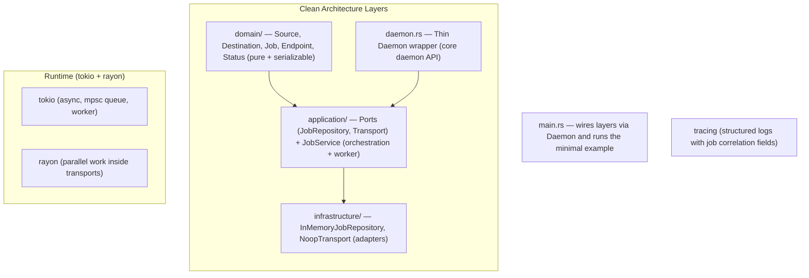

# UniFlow Phase 0 — Architecture & Foundation

Clean Architecture implementation of the core daemon and job model (Phase 0).

Based on the UniFlow Master Blueprint (Sections 3, 9, 13 + P0 requirements).

## Connection-Agnostic Design (Blueprint Sec 3, p7)

> "In the refactored model, you declare Source + Destination + Mode — and UniFlow's intelligence layer automatically probes and selects the fastest available connection ... The transfer engine is transport-blind by design."

**Phase 0 directly implements this**:
- Explicit first-class types: `Source(Endpoint)` and `Destination(Endpoint)`.
- `Job { source: Source, destination: Destination, mode: TransferMode, ... }`
- Execution goes through `Transport` port (defined in `application/ports`).
- Only `NoopTransport` in P0; real implementations (LAN, P2P/Iroh, Cloud/rclone, SSH, gRPC, etc.) can be added later without touching the domain or core orchestration.

`Endpoint` (in domain) normalizes all location types per blueprint p15. The model stays deliberately transport-blind.

## Core Runtime (Blueprint Sec 13, pp33-35)

**Approved stack (verbatim from the table)**:

| Component      | Primary Technology          | Key Sub-Dependencies                  |
|----------------|-----------------------------|---------------------------------------|
| Core Runtime   | **Rust**                    | **tokio** (async I/O + event loop), **rayon** (data-parallelism / work-stealing thread pool) |

Phase 0 uses **exactly** this combination:
- `tokio::main`, `tokio::sync::mpsc`, `tokio::spawn`, `tokio::time::sleep`
- `rayon` par-iter / join inside the Noop transport (and available in Executor) to prove the work-stealing pool
- All other Sec 13 items (rclone gRPC IPC, iroh/libp2p+quinn, blake3, rust-rocksdb, tonic, tungstenite, rustls, ...) are intentionally left for later phases but the modularity guarantees they can be added without touching the job model or daemon core.

## Current Structure (Clean Architecture)

```
D:\uniflow\src\
├── domain/                  # Pure business entities (no tokio, no persistence)
│   └── models.rs            # Source, Destination, Endpoint, Job, TransferMode, JobStatus, ...
├── application/
│   ├── ports.rs             # JobRepository + Transport (connection-agnostic ports)
│   └── services/job_service.rs  # Orchestration, lifecycle, background worker
├── infrastructure/          # Adapters
│   ├── persistence/in_memory.rs
│   └── transport/noop.rs
├── daemon.rs                # Thin Daemon wrapper (the core "daemon" entrypoint)
├── lib.rs
├── error.rs
├── logging.rs
└── main.rs                  # Minimal working example
```

## Mermaid Architecture Diagram (Simplified for Phase 0)



## How This Phase 0 Foundation Enables All Later Phases

1. **Pluggable transports (LAN / P2P / Cloud / SSH / gRPC relay)**  
   The `Job` (source+dest+mode declaration) + `Transport` trait + `Router::select` is the literal realization of the blueprint's "transport-blind" engine. New backends are additive only.

2. **Persistence, resume, recovery, idempotency**  
   `Job` is serializable. `JobStore` trait + `checkpoint` field + lifecycle hooks implement the P0 "Resume & checkpointing" and "Recovery & Idempotency" requirements. Swapping the in-memory impl for `RocksDBJobStore` is a one-module change.

3. **Core runtime (tokio + rayon)**  
   Uses the exact stack from Sec 13. Future delta/hashing/parallel work reuses the same execution paths.

4. **API surface**  
   `Daemon` exposes `submit_job`, `cancel_job`, `get_job`, `list_jobs`. Future tonic / tungstenite modules can wrap it directly.

5. **Observability**  
   Structured tracing with job correlation fields provides the P0 audit log foundation.

6. **Phased delivery**  
   Matches the "highest-value first" approach on p32 of the blueprint. P1/P2 items are additive.

7. **Deployment**  
   The `uniflowd` binary is the unified daemon ready for on-prem, cloud, edge, Tauri, or Flutter embedding.

In short: the artifacts (especially explicit `Source`/`Destination`, `Job`, `Transport` port, `JobService`, and `Daemon`) form the stable foundation for all later phases.

## Verification of the Skeleton

See the root `README.md` and run:

```powershell
cd D:\uniflow
cargo run
```

Expected: clean structured logs showing two jobs, one completing successfully, one being cancelled, plus a pretty-printed JSON `Job` at the end, plus a `uniflow_jobs.snapshot.json` file demonstrating the persist path.

---

# Self-Optimizing Migration Engine (Profiler → Planner → Parallel Core)

This section documents the engine added on top of the skeleton: it **profiles the
infrastructure, tunes itself to a near-optimal plan, then transfers in parallel**,
saturating the available hardware. It implements the existing ports — no layer was
rebuilt.

## Layered placement

```
domain::profile  (EndpointProfile, LinkProfile, PairProfile, SimdLevel, StorageClass, ...)
domain::plan     (TransferPlan, CompressionCodec, EncryptionCodec, TransportHint)
        ▲ pure, serializable values
application::ports::{SystemProfiler, Planner, ComputeOffload}   ← new contracts
        ▲ traits only
infrastructure::intelligence::{profiler, planner, offload}      ← detection + cost model
infrastructure::transfer::{parallel, control, adapters, normalize, paths}  ← hot path
```

The `Transport` port is unchanged, so `ParallelTransport` drops in wherever
`LocalDeltaTransport` did; `TransportRouter` selects it via `TransferPlan.transport`.

## 1. Profiler heuristics (`infrastructure::intelligence::profiler`)

`DefaultSystemProfiler` builds a `PairProfile` and **caches it per endpoint pair**
(5-minute TTL) so repeat jobs over the same route skip re-probing.

- **CPU / SIMD / AES** — `std::arch` runtime feature detection (no deps): widest of
  AVX-512 > AVX2 > SSE4.2 (x86) / NEON (aarch64); AES-NL / FEAT_AES presence decides
  the cipher. Core counts from `sysinfo` (physical) + `available_parallelism` (logical).
- **Memory** — total/available from `sysinfo` (bounds the in-flight memory budget).
- **Storage** — `sysinfo` disk kinds → `StorageClass` (NVMe/SSD/HDD/Flash); each
  class carries a conservative sequential-read ceiling and a "benefits from random
  parallelism" flag (true for solid state, false for spinning disks).
- **GPU** — best-effort env/driver hint + Apple unified memory; absence simply means
  the planner won't pick GPU offload.
- **OS / FS** — platform, case-sensitivity, max path length, max open FDs, async-IO
  backend (io_uring ≥ 5.1 read from `/proc/sys/kernel/osrelease`, else IOCP/kqueue/
  epoll), permission/symlink preservation, timestamp resolution.
- **Network** — same-host ⇒ `Loopback` (network not the bottleneck); cloud ⇒ `Wan`
  estimate; otherwise a real TCP-connect RTT/jitter/loss probe with an honest LAN
  estimate when no address resolves. `LinkProfile::bdp_bytes()` exposes the
  bandwidth-delay product the planner sizes chunks from.

Every fact records *how it was obtained* in an `explanation` string (auditability).

## 2. Planner cost model (`infrastructure::intelligence::planner`)

`CostModelPlanner` reasons about three throughput ceilings — `T_net` (link),
`T_disk` (storage class), `T_cpu` (hash + optional compress/encrypt, scaled by SIMD
and cores) — and tunes the pipeline to the bottleneck. Documented derivations:

| Decision | Rule (rationale) |
|---|---|
| **chunk_size** | WAN/Relay: `BDP/4` so ~4 chunks fill the pipe. LAN: 4 MiB (syscall amortisation vs latency). Loopback: sized to storage medium (NVMe 16 MiB, SSD/Flash 8 MiB, HDD 1 MiB to bound seeks). Clamp [256 KiB, 64 MiB]. |
| **stream_count** | Loopback 1 (parallelism is in the worker pool); LAN 4; WAN `ceil(BDP/chunk)` clamped [4,32] (fill the pipe, avoid self-congestion); Relay 2 (bandwidth-capped). |
| **worker_threads** | `min(cores_src, cores_dst) − 1` (reserve one for IO) — sized to the *slower* endpoint. |
| **max_in_flight** | `min(0.25 × min_available_RAM, 1 GiB) / chunk`, clamped ≥ 2. Peak buffer memory = `chunk × max_in_flight`. |
| **compression** | Only when the **link is the bottleneck** *and* CPU compresses faster than the link drains (else compression *is* the bottleneck). Level scales inversely with link speed (slow link → higher level). Off on loopback. |
| **encryption** | AES-256-GCM iff **both** ends have AES hardware (multi-GB/s); else ChaCha20-Poly1305. Honoured per `policy.encrypt_in_transit`. |
| **GPU offload** | Only if a GPU is present, the `gpu` feature is built, and CPU is the predicted bottleneck. Always has a CPU fallback. |

Constants (e.g. `ZSTD_MBPS_PER_CORE=450`, `BLAKE3_MBPS_PER_CORE_BASE=1500`,
`RAM_BUDGET_FRACTION=0.25`, `MAX_INFLIGHT_MEMORY=1 GiB`) are named with rationale in
the source — no bare magic numbers. The plan records `cost_estimated_mbps` and
`cost_bottleneck` for replay.

## 3. Adaptive control loop (`infrastructure::transfer::control`)

The transfer runs an **AIMD** controller over the in-flight window (exactly like TCP
congestion control), realised by a `DynamicSemaphore`:

- throughput improving and no RAM pressure ⇒ **additive increase** (`window += 1`),
- throughput regresses or available RAM drops below the floor ⇒ **multiplicative
  decrease** (`window /= 2`).

The window is hard-bounded by `max_in_flight` *and* a memory cap, so peak buffer
memory is always `window × chunk_size ≤ memory_budget`. The window-size history is
captured for observability.

## 4. Parallel transfer core (`infrastructure::transfer::parallel`)

Per chunk: **read → BLAKE3 hash → [zstd compress] → [AEAD encrypt] → wire →
[decrypt] → [decompress] → verify → write_at**, across a bounded worker pool sized
from the plan. Reads use mmap for large files (positioned-read fallback); writes use
cross-platform positioned writes so many workers hit distinct offsets concurrently.

Safety (non-negotiables):
- **Per-chunk + end-to-end BLAKE3** integrity (the existing parallel hasher, not
  regressed).
- **Atomic-on-completion**: write to `*.uniflow-tmp`, fsync, verify, then rename —
  the destination is never partially overwritten.
- **Resume**: a checkpoint sidecar records the highest contiguous byte offset; a
  re-run resends only beyond it.
- **Client-side encryption preserved**: compression/encryption are transport stages,
  reversed before the (plaintext) destination is written, so integrity and the
  zero-knowledge crypto path hold for the new core.
- **Graceful degradation**: GPU→CPU, mmap→buffered, multi-stream→single,
  compression→none all fall back so a low-end/restricted environment still completes.

## 5. Cross-platform normalization (`infrastructure::transfer::normalize`)

ONE place reconciles the FS differences the Profiler found: separator conversion,
path-traversal/absolute/drive-letter rejection, Windows reserved-name + illegal-char
+ trailing dot/space rejection, max-path enforcement, case-collision detection
(case-sensitive → insensitive), timestamp-resolution rounding, and
permission/symlink-preservation decisions. The transport boundary that a mobile
client drives is documented in `docs/client-contract.md`.

## Throughput-vs-safety trade-offs (flagged)

- Atomic temp+rename and end-to-end re-verify cost an extra pass — **chosen for
  safety** (no partial/ corrupt destination). The verify pass is skippable only via
  `policy.verify_integrity = false`.
- Compression is *skipped* when the cost model predicts it would bottleneck the
  pipeline — a throughput choice, always per-plan and reversible.
