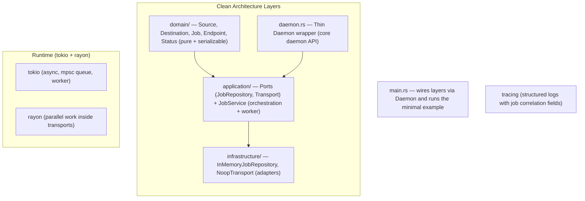

# UniFlow Phase 0 — Architecture & Foundation

Clean Architecture implementation of the core daemon and job model (Phase 0).

Based on the UniFlow Master Blueprint (Sections 3, 9, 13 + P0 requirements).

## Connection-Agnostic Design (Blueprint Sec 3, p7)

> "In the refactored model, you declare Source + Destination + Mode — and UniFlow's intelligence layer automatically probes and selects the fastest available connection ... The transfer engine is transport-blind by design."

**Phase 0 directly implements this**:
- Explicit first-class types: `Source(Endpoint)` and `Destination(Endpoint)`.
- `Job { source: Source, destination: Destination, mode: TransferMode, ... }`
- Execution goes through `Transport` port (defined in `application/ports`).
- Only `NoopTransport` in P0; real implementations (LAN, P2P/Iroh, Cloud/rclone, SSH, gRPC, etc.) can be added later without touching the domain or core orchestration.

`Endpoint` (in domain) normalizes all location types per blueprint p15. The model stays deliberately transport-blind.

## Core Runtime (Blueprint Sec 13, pp33-35)

**Approved stack (verbatim from the table)**:

| Component      | Primary Technology          | Key Sub-Dependencies                  |
|----------------|-----------------------------|---------------------------------------|
| Core Runtime   | **Rust**                    | **tokio** (async I/O + event loop), **rayon** (data-parallelism / work-stealing thread pool) |

Phase 0 uses **exactly** this combination:
- `tokio::main`, `tokio::sync::mpsc`, `tokio::spawn`, `tokio::time::sleep`
- `rayon` par-iter / join inside the Noop transport (and available in Executor) to prove the work-stealing pool
- All other Sec 13 items (rclone gRPC IPC, iroh/libp2p+quinn, blake3, rust-rocksdb, tonic, tungstenite, rustls, ...) are intentionally left for later phases but the modularity guarantees they can be added without touching the job model or daemon core.

## Current Structure (Clean Architecture)

```
D:\uniflow\src\
├── domain/                  # Pure business entities (no tokio, no persistence)
│   └── models.rs            # Source, Destination, Endpoint, Job, TransferMode, JobStatus, ...
├── application/
│   ├── ports.rs             # JobRepository + Transport (connection-agnostic ports)
│   └── services/job_service.rs  # Orchestration, lifecycle, background worker
├── infrastructure/          # Adapters
│   ├── persistence/in_memory.rs
│   └── transport/noop.rs
├── daemon.rs                # Thin Daemon wrapper (the core "daemon" entrypoint)
├── lib.rs
├── error.rs
├── logging.rs
└── main.rs                  # Minimal working example
```

## Mermaid Architecture Diagram (Simplified for Phase 0)



## How This Phase 0 Foundation Enables All Later Phases

1. **Pluggable transports (LAN / P2P / Cloud / SSH / gRPC relay)**  
   The `Job` (source+dest+mode declaration) + `Transport` trait + `Router::select` is the literal realization of the blueprint's "transport-blind" engine. New backends are additive only.

2. **Persistence, resume, recovery, idempotency**  
   `Job` is serializable. `JobStore` trait + `checkpoint` field + lifecycle hooks implement the P0 "Resume & checkpointing" and "Recovery & Idempotency" requirements. Swapping the in-memory impl for `RocksDBJobStore` is a one-module change.

3. **Core runtime (tokio + rayon)**  
   Uses the exact stack from Sec 13. Future delta/hashing/parallel work reuses the same execution paths.

4. **API surface**  
   `Daemon` exposes `submit_job`, `cancel_job`, `get_job`, `list_jobs`. Future tonic / tungstenite modules can wrap it directly.

5. **Observability**  
   Structured tracing with job correlation fields provides the P0 audit log foundation.

6. **Phased delivery**  
   Matches the "highest-value first" approach on p32 of the blueprint. P1/P2 items are additive.

7. **Deployment**  
   The `uniflowd` binary is the unified daemon ready for on-prem, cloud, edge, Tauri, or Flutter embedding.

In short: the artifacts (especially explicit `Source`/`Destination`, `Job`, `Transport` port, `JobService`, and `Daemon`) form the stable foundation for all later phases.

## Verification of the Skeleton

See the root `README.md` and run:

```powershell
cd D:\uniflow
cargo run
```

Expected: clean structured logs showing two jobs, one completing successfully, one being cancelled, plus a pretty-printed JSON `Job` at the end, plus a `uniflow_jobs.snapshot.json` file demonstrating the persist path.
